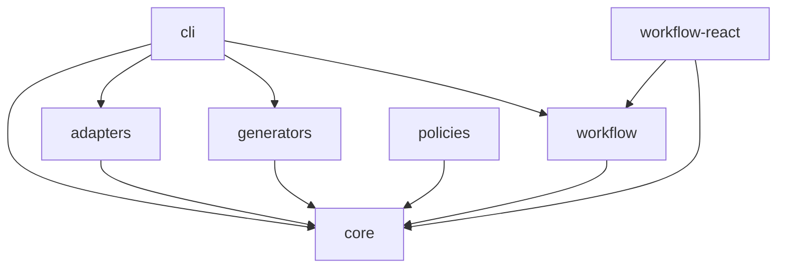

# Packages Overview

c4c is organized into modular packages, each serving a specific purpose.

## Core Packages

### [@c4c/core](/packages/core)

The foundation of c4c. Provides core types, registry, and execution engine.

**Key Features:**
- Type definitions for procedures and contracts
- Registry for discovering procedures
- Execution engine with context management
- Policy system for cross-cutting concerns
- Trigger support

**Install:**
```bash
pnpm add @c4c/core zod
```

**Use When:**
- Building any c4c application
- Required by all other packages

---

### [@c4c/workflow](/packages/workflow)

Workflow orchestration engine with fluent builder API.

**Key Features:**
- Fluent builder for defining workflows
- Sequential and parallel execution
- Conditional branching
- Context sharing between steps
- OpenTelemetry tracing

**Install:**
```bash
pnpm add @c4c/workflow
```

**Use When:**
- Orchestrating multiple procedures
- Building complex business processes
- Need parallel execution or branching

---

### [@c4c/adapters](/packages/adapters)

HTTP, REST, and CLI adapters for procedures.

**Key Features:**
- HTTP server with RPC endpoints
- REST endpoint mapping
- CLI execution
- Request validation
- Error handling

**Install:**
```bash
pnpm add @c4c/adapters
```

**Use When:**
- Exposing procedures via HTTP
- Building REST APIs
- Need CLI access to procedures

---

### [@c4c/policies](/packages/policies)

Composable policies for authentication, retry, logging, and more.

**Key Features:**
- Retry with exponential backoff
- Structured logging
- OpenTelemetry spans
- Rate limiting
- OAuth authentication
- Role-based authorization

**Install:**
```bash
pnpm add @c4c/policies
```

**Use When:**
- Need authentication/authorization
- Want retry logic
- Need distributed tracing
- Rate limiting required

---

### [@c4c/generators](/packages/generators)

OpenAPI spec and TypeScript client generation.

**Key Features:**
- OpenAPI 3.0 generation from Zod schemas
- Type-safe TypeScript client generation
- Auth-aware clients
- Dynamic token support
- Zero runtime dependencies

**Install:**
```bash
pnpm add @c4c/generators
```

**Use When:**
- Need API documentation
- Want type-safe clients
- Integrating with external tools

---

### [@c4c/workflow-react](/packages/workflow-react)

React hooks for workflow integration.

**Key Features:**
- useWorkflow hook
- useWorkflowStatus hook
- Type-safe workflow execution
- Suspense support

**Install:**
```bash
pnpm add @c4c/workflow-react react
```

**Use When:**
- Building React applications
- Need workflow UI components
- Want React integration

---

### [@c4c/cli](/packages/cli)

Command-line interface for c4c.

**Key Features:**
- Development server with hot reload
- Production server
- Procedure execution
- Code generation
- Integration tools

**Install:**
```bash
pnpm add -D @c4c/cli
```

**Use When:**
- Local development
- CI/CD pipelines
- Scripting and automation

---

## Package Dependencies



## Installation Guide

### Minimal Setup

For basic procedure execution:

```bash
pnpm add @c4c/core zod
pnpm add -D @c4c/cli typescript
```

### Full Setup

For complete features:

```bash
# Runtime dependencies
pnpm add @c4c/core @c4c/workflow @c4c/policies zod

# Development dependencies
pnpm add -D @c4c/cli @c4c/generators typescript @types/node
```

### React Integration

For React applications:

```bash
pnpm add @c4c/core @c4c/workflow @c4c/workflow-react react
```

## Package Versions

All packages share the same version number and are released together:

```json
{
  "dependencies": {
    "@c4c/core": "^0.1.0",
    "@c4c/workflow": "^0.1.0",
    "@c4c/policies": "^0.1.0"
  }
}
```

## TypeScript Configuration

All packages require TypeScript 5+ with ESM:

```json
{
  "compilerOptions": {
    "target": "ES2022",
    "module": "ESNext",
    "moduleResolution": "bundler",
    "esModuleInterop": true,
    "strict": true
  }
}
```

## Usage Examples

### Core Only

```typescript
import { type Procedure } from "@c4c/core";
import { z } from "zod";

export const myProcedure: Procedure = {
  contract: {
    input: z.object({ name: z.string() }),
    output: z.object({ message: z.string() }),
  },
  handler: async (input) => {
    return { message: `Hello, ${input.name}!` };
  },
};
```

### With Workflow

```typescript
import { workflow, step } from "@c4c/workflow";

export default workflow("my-workflow")
  .step(step({
    id: "step1",
    execute: ({ engine }) => engine.run("myProcedure", { name: "Alice" }),
  }))
  .commit();
```

### With Policies

```typescript
import { type Procedure, applyPolicies } from "@c4c/core";
import { withRetry, withLogging } from "@c4c/policies";

export const myProcedure: Procedure = {
  contract: { ... },
  handler: applyPolicies(
    async (input) => { ... },
    withLogging("myProcedure"),
    withRetry({ maxAttempts: 3 })
  ),
};
```

### With React

```typescript
import { useWorkflow } from "@c4c/workflow-react";

function MyComponent() {
  const { execute, result, loading } = useWorkflow("my-workflow");
  
  return (
    <button onClick={() => execute({ name: "Alice" })}>
      {loading ? "Loading..." : "Execute"}
    </button>
  );
}
```

## Next Steps

Explore individual package documentation:

- [@c4c/core](/packages/core) - Core framework
- [@c4c/workflow](/packages/workflow) - Workflow engine
- [@c4c/adapters](/packages/adapters) - HTTP and CLI adapters
- [@c4c/policies](/packages/policies) - Composable policies
- [@c4c/generators](/packages/generators) - Code generation
- [@c4c/workflow-react](/packages/workflow-react) - React integration
- [@c4c/cli](/packages/cli) - Command-line interface
